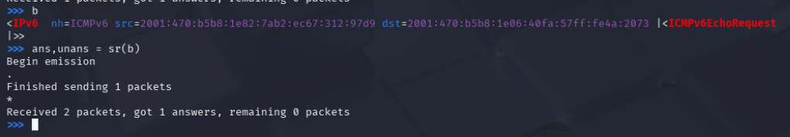
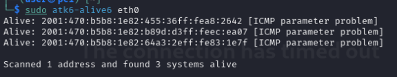

# IPv6 Security

Targetted hosts are:

- kali (attacker)
- webserver (victim)


# First Exercise (Ping & Sniff)

1) Webserver context

```bash
root@webserver:~# ip a
1: lo: <LOOPBACK,UP,LOWER_UP> mtu 65536 qdisc noqueue state UNKNOWN group default qlen 1000
    link/loopback 00:00:00:00:00:00 brd 00:00:00:00:00:00
    inet 127.0.0.1/8 scope host lo
       valid_lft forever preferred_lft forever
    inet6 ::1/128 scope host 
       valid_lft forever preferred_lft forever
2: eth0@if6178: <BROADCAST,MULTICAST,UP,LOWER_UP> mtu 1400 qdisc noqueue state UP group default qlen 1000
    link/ether 42:fa:57:4a:20:73 brd ff:ff:ff:ff:ff:ff link-netnsid 0
    inet 100.100.6.2/24 brd 100.100.6.255 scope global eth0
       valid_lft forever preferred_lft forever
    inet6 2001:470:b5b8:1e06:40fa:57ff:fe4a:2073/64 scope global dynamic mngtmpaddr 
       valid_lft 86388sec preferred_lft 14388sec
    inet6 fe80::40fa:57ff:fe4a:2073/64 scope link 
       valid_lft forever preferred_lft forever
root@webserver:~# 
```

We see having ipv6 assigned under eth0 so we start sniffing from eth0

```bash
                                      
                     aSPY//YASa       
             apyyyyCY//////////YCa       |
            sY//////YSpcs  scpCY//Pp     | Welcome to Scapy
 ayp ayyyyyyySCP//Pp           syY//C    | Version 2.4.4
 AYAsAYYYYYYYY///Ps              cY//S   |
         pCCCCY//p          cSSps y//Y   | https://github.com/secdev/scapy
         SPPPP///a          pP///AC//Y   |
              A//A            cyP////C   | Have fun!
              p///Ac            sC///a   |
              P////YCpc           A//A   | We are in France, we say Skappee.
       scccccp///pSP///p          p//Y   | OK? Merci.
      sY/////////y  caa           S//P   |             -- Sebastien Chabal
       cayCyayP//Ya              pY/Ya   |
        sY/PsY////YCc          aC//Yp 
         sc  sccaCY//PCypaapyCP//YSs  
                  spCPY//////YPSps    
                       ccaacs         
                                       using IPython 7.20.0
>>> pkts=sniff(iface="eth0", lfilter = lambda x: x.haslayer(IPv6))
```


2) We start pinging from kali interface with correct ips





3) Receiving traffic (kali->webserer)

```bash
>> pkts.show()
0000 Ether / IPv6 / ICMPv6 Echo Request (id: 0x0 seq: 0x0)
0001 Ether / IPv6 / ICMPv6 Echo Reply (id: 0x0 seq: 0x0)
0002 Ether / IPv6 / ICMPv6ND_NS / ICMPv6 Neighbor Discovery Option - Source Link-Layer Address 42:fa:57:4a:20:73
0003 Ether / IPv6 / ICMPv6 Neighbor Discovery - Neighbor Advertisement (tgt: fe80::44fd:65ff:fe1b:8895)
0004 Ether / IPv6 / ICMPv6ND_NS / ICMPv6 Neighbor Discovery Option - Source Link-Layer Address 46:fd:65:1b:88:95
0005 Ether / IPv6 / ICMPv6 Neighbor Discovery - Neighbor Advertisement (tgt: 2001:470:b5b8:1e06:40fa:57ff:fe4a:2073)
0006 Ether / IPv6 / ICMPv6ND_NS / ICMPv6 Neighbor Discovery Option - Source Link-Layer Address 46:fd:65:1b:88:95
0007 Ether / IPv6 / ICMPv6 Neighbor Discovery - Neighbor Advertisement (tgt: fe80::40fa:57ff:fe4a:2073)
0008 Ether / IPv6 / ICMPv6ND_NS / ICMPv6 Neighbor Discovery Option - Source Link-Layer Address 42:fa:57:4a:20:73
0009 Ether / IPv6 / ICMPv6 Neighbor Discovery - Neighbor Advertisement (tgt: 2001:470:b5b8:1e06:44fd:65ff:fe1b:8895)
```

# Network Discovery


1) Run alive6 as it is from (kali)




2) From a target perspective running tcpdump we see:


```bash
root@arpwatch-clients:~# tcpdump -r net_scan.pcap 
reading from file net_scan.pcap, link-type EN10MB (Ethernet), snapshot length 262144
16:30:12.566524 IP6 2001:470:b5b8:1e82:7ab2:ec67:312:97d9 > ip6-allnodes: ICMP6, echo request, id 64206, seq 47806, length 16
16:30:12.566623 IP6 2001:470:b5b8:1e82:b89d:d3ff:feec:ea07 > ff02::1:ff12:97d9: ICMP6, neighbor solicitation, who has 2001:470:b5b8:1e82:7ab2:ec67:312:97d9, length 32
16:30:12.566778 IP6 2001:470:b5b8:1e82:455:36ff:fea8:2642 > ff02::1:ff12:97d9: ICMP6, neighbor solicitation, who has 2001:470:b5b8:1e82:7ab2:ec67:312:97d9, length 32
16:30:12.566856 IP6 2001:470:b5b8:1e82:7ab2:ec67:312:97d9 > ip6-allnodes: DSTOPT ICMP6, echo request, id 64206, seq 47806, length 16
16:30:12.567155 IP6 2001:470:b5b8:1e82:7ab2:ec67:312:97d9 > 2001:470:b5b8:1e82:b89d:d3ff:feec:ea07: ICMP6, neighbor advertisement, tgt is 2001:470:b5b8:1e82:7ab2:ec67:312:97d9, length 32
16:30:12.567164 IP6 2001:470:b5b8:1e82:b89d:d3ff:feec:ea07 > 2001:470:b5b8:1e82:7ab2:ec67:312:97d9: ICMP6, echo reply, id 64206, seq 47806, length 16
16:30:12.567165 IP6 2001:470:b5b8:1e82:b89d:d3ff:feec:ea07 > 2001:470:b5b8:1e82:7ab2:ec67:312:97d9: ICMP6, parameter problem, option - octet 42, length 72
16:30:17.573639 IP6 fe80::476a:a47b:68a:a64d > 2001:470:b5b8:1e82:b89d:d3ff:feec:ea07: ICMP6, neighbor solicitation, who has 2001:470:b5b8:1e82:b89d:d3ff:feec:ea07, length 32
16:30:17.573735 IP6 2001:470:b5b8:1e82:b89d:d3ff:feec:ea07 > fe80::476a:a47b:68a:a64d: ICMP6, neighbor advertisement, tgt is 2001:470:b5b8:1e82:b89d:d3ff:feec:ea07, length 24
root@arpwatch-clients:~# 
```


## Examination


1. We have attacker: ```2001:470:b5b8:1e82:7ab2:ec67:312:97d9``` (which is kali user)
2. We have responding host: ```2001:470:b5b8:1e82:b89d:d3ff:feec:ea07``` (arp-watch on the same subnet) 
3. other hosts in the subnet

## Packets Sequence

1) Ping multicast allnodes (ip6-allnodes = ff02::1)
2) The host that received the ping responded with Neighbor Solicitation multicast

```bash
…:b89d:…:ea07   > ff02::1:ff12:97d9: NS, who has …:312:97d9
…:455:…:2642    > ff02::1:ff12:97d9: NS, who has …:312:97d9
```

to our attacker

3) Second echo request, this time using DSTOPT (Destination Options extension header)

```bash
…:312:97d9 > ip6-allnodes: DSTOPT ICMP6, echo request
```

Attacker sends second ping, this is used to test how the client handle the extension header (some firewall are dumb)

4) Neighbor Advertisement from the attacker

```bash
…:312:97d9 > …:b89d:…:ea07: NA, tgt is …:312:97d9
```

Now the attacker is responding to the NS sent by the host with his MAC address

5) Echo reply from the first ping

```bash
…:b89d:…:ea07 > …:312:97d9: ICMP6, echo reply
```


6) Even if the firewall blocks normal ICMPv6, we can spot ipv6 clients using the RFC 4890 standard, since we get 
```bash
…:b89d:…:ea07 > …:312:97d9: ICMP6, parameter problem, option - octet 42
```

we know that echo request using DSTOPT generates Parameter problem, so we know it exists !!!!! 


