# Step 1. Create PKI

System -> trust -> authorities


1) We create custom CA using RSA (2048 bytes key length)


# Step 2. Create certificates


1) Server certificate for OpenVPN Server inside main firewall:
    - System -> Trust -> Certificates
    - Create a server certificate using the CA created

2) Create client certificates according to assignemnt requiremenets so:
    - Alice
    - Bob
    - Christina
    - Diana


# Step 3. Create static TLS Key

Just shared secret between server and client. It's not the crypting method, just another "safe level" to prevent tls handshake DoS....

VPN -> OpenVPN -> Static keys


# Step 4. Create OpenVPN Instance

1) Get WAN Address to bind (100.100.0.2/24) in our case
2) Select address space for VPN for subnetting

- We use /22 netmask since we NEED only 4 subnets (in our topology)
- so 2^10 = 1024 address, 1024 / 256 = 4, so we have

- 10.8.0.0 -> 10.8.3.255


# Step 5. Client specific overrides

## Alice (External)

- Push Reset (Blocks all common routes, we want to whitelist them)
- ipv4 tunnel: 10.8.0.0/30
    - /30 so we only have 4 address to assign (first .0 is for external subnet)

- local network is 100.100.4.0/24

## Bob (Standard-DMZ)

10.8.1.0/30


- local network in 100.100.6.0/24


## Christina (Power-DMZ+Internal servers)

10.8.2.0/30


- local network is 100.100.6.0 + 100.100.1.0/24

## Diana (Admin)

10.8.3.0/30

diana is all local so:

100.100.6.0/24
100.100.4.0/24
100.100.1.0/24
100.100.2.0/24


# Step 6. Create Firewall Alias

- Alice external (vpn_external), type network content is 10.8.0.0/24
- Bob Standard (vpn_standard), type network content is 10.8.1.0/24
- Christina external (vpn_power), type network content is 10.8.2.0/24
- Diana external (vpn_admin), type network content is 10.8.3.0/24

# Step  7. Create Firewall Rule to allow UDP 1194 OpenVPN Traffic

Firewall -> Rules -> WAN 1194 Pass on UDP

# Step 8. Creare Firewall rule to allow firewall aliases

- External rule on OpenVPN

Firewall -> Rules -> OpenVPN

Source vpn_external
Destination: EXTERNAL_CLIENTS net

- Standard rule


Source: vpn_standard
Destionation: DMZ net


- Power rule

Source: vpn_power
Destination: DMZ + Internal net


- Admin rule

Source: vpn_admin
Destination: any


# Step 9. any -> any BLOCK

Add rule to block clients not allowed, so it's OpenVPN Rule

source: any dest: any (BLOCK)


# Step 9.5 All OpenVPN Rules

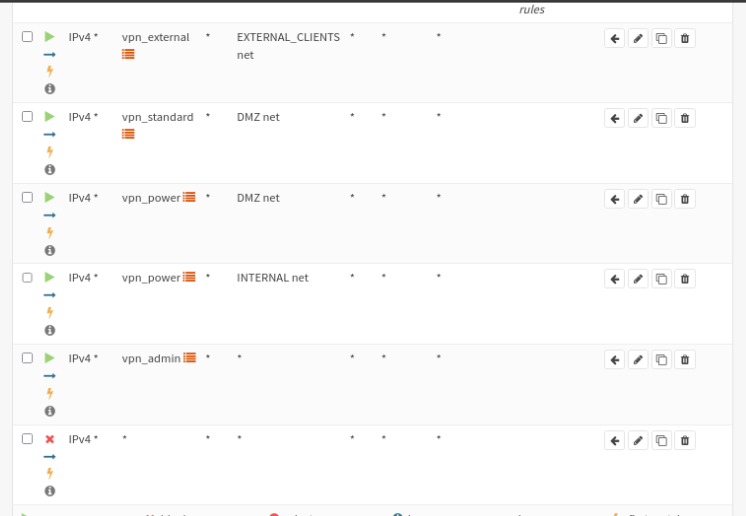


# Step 10. Download OpenVPN Client cert

Download


# Step 11. Connect 


```bash
➜  ACME_30_Roadwarriors_alice git:(main) ✗ sudo openvpn ACME_30_Roadwarriors_alice.ovpn 
2026-05-22 18:11:28 DEPRECATED OPTION: --persist-key option ignored. Keys are now always persisted across restarts. 
2026-05-22 18:11:28 Note: --cipher is not set. OpenVPN versions before 2.5 defaulted to BF-CBC as fallback when cipher negotiation failed in this case. If you need this fallback please add '--data-ciphers-fallback BF-CBC' to your configuration and/or add BF-CBC to --data-ciphers. E.g. --data-ciphers DEFAULT:BF-CBC
2026-05-22 18:11:28 WARNING: file 'ACME_30_Roadwarriors_alice.p12' is group or others accessible
2026-05-22 18:11:28 OpenVPN 2.7.4 [git:makepkg/8e9e91f4caff9a80+] x86_64-pc-linux-gnu [SSL (OpenSSL)] [LZO] [LZ4] [EPOLL] [PKCS11] [MH/PKTINFO] [AEAD] [DCO] built on Apr 30 2026
2026-05-22 18:11:28 library versions: OpenSSL 3.6.2 7 Apr 2026, LZO 2.10
2026-05-22 18:11:28 DCO version: 7.0.9-arch1-1 #1 SMP PREEMPT_DYNAMIC Sun, 17 May 2026 17:23:07 +0000
2026-05-22 18:11:28 TCP/UDP: Preserving recently used remote address: [AF_INET]100.100.0.2:1194
2026-05-22 18:11:28 UDPv4 link local: (not bound)
2026-05-22 18:11:28 UDPv4 link remote: [AF_INET]100.100.0.2:1194
2026-05-22 18:11:28 [openvpn-server] Peer Connection Initiated with [AF_INET]100.100.0.2:1194
2026-05-22 18:11:29 DCO device tun0 opened
2026-05-22 18:11:29 ovpn-dco device [tun0] opened
2026-05-22 18:11:29 net_iface_mtu_set: mtu 1500 for tun0
2026-05-22 18:11:29 net_iface_up: set tun0 up
2026-05-22 18:11:29 net_addr_v4_add: 10.8.0.2/22 dev tun0
2026-05-22 18:11:29 Initialization Sequence Completed

```


# Step 12. Test connection


```bash
8: tun0: <POINTOPOINT,NOARP,UP,LOWER_UP> mtu 1500 qdisc noqueue state UP group default qlen 1000
    link/none 
    inet 10.8.0.2/22 brd 10.8.3.255 scope global tun0
       valid_lft forever preferred_lft forever
    inet6 fe80::4192:9846:8f78:8dc8/64 scope link stable-privacy proto kernel_ll 
       valid_lft forever preferred_lft forever
➜  ~ ping -I tun0 100.100.2.1
PING 100.100.2.1 (100.100.2.1) from 10.8.0.2 tun0: 56(84) bytes of data.
^C
--- 100.100.2.1 ping statistics ---
4 packets transmitted, 0 received, 100% packet loss, time 3078ms

➜  ~ ping -I tun0 100.100.4.1 
PING 100.100.4.1 (100.100.4.1) from 10.8.0.2 tun0: 56(84) bytes of data.
64 bytes from 100.100.4.1: icmp_seq=1 ttl=64 time=25.7 ms
64 bytes from 100.100.4.1: icmp_seq=2 ttl=64 time=25.7 ms
64 bytes from 100.100.4.1: icmp_seq=3 ttl=64 time=44.6 ms
^C
--- 100.100.4.1 ping statistics ---
3 packets transmitted, 3 received, 0% packet loss, time 2002ms
rtt min/avg/max/mdev = 25.741/32.036/44.620/8.898 ms
➜  ~ 
```

It works with alice certificate pinging only external clients in .4 subnet!!!!!


# PKI X.509???

Yes since we created CA!!!!


# Does it work? Let's check wireshark


## Step 1


We first check if using physical interface (actually it's still virtual since we are in double VPN setup (lol))

```bash
7: tap0: <BROADCAST,MULTICAST,UP,LOWER_UP> mtu 1500 qdisc fq_codel state UNKNOWN group default qlen 1000
    link/ether ee:44:b7:80:a9:54 brd ff:ff:ff:ff:ff:ff
    inet 100.101.0.2/24 brd 100.101.0.255 scope global tap0
       valid_lft forever preferred_lft forever
    inet6 fe80::9423:aff:fe89:408f/64 scope link proto kernel_ll 
       valid_lft forever preferred_lft forever
8: tun0: <POINTOPOINT,NOARP,UP,LOWER_UP> mtu 1500 qdisc noqueue state UP group default qlen 1000
    link/none 
    inet 10.8.0.2/22 brd 10.8.3.255 scope global tun0
       valid_lft forever preferred_lft forever
    inet6 fe80::4192:9846:8f78:8dc8/64 scope link stable-privacy proto kernel_ll 
       valid_lft forever preferred_lft forever
➜  ~ 
```

So it's

- tap0 (fake physical)
- tun0 (tunnel VPN, with alice certificate)


## Step 2


### tap0 (crypted)

We filter wireshark on tap0 interface using filter udp.port == 1194


and with a simple ping to 100.100.4.1 device we see

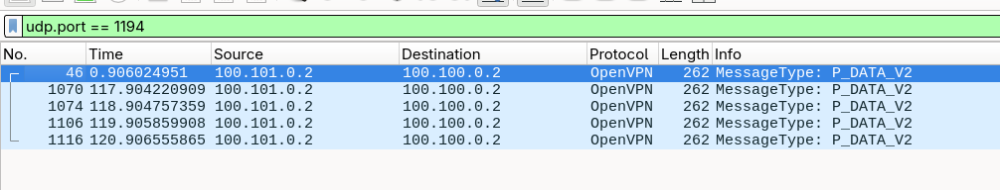

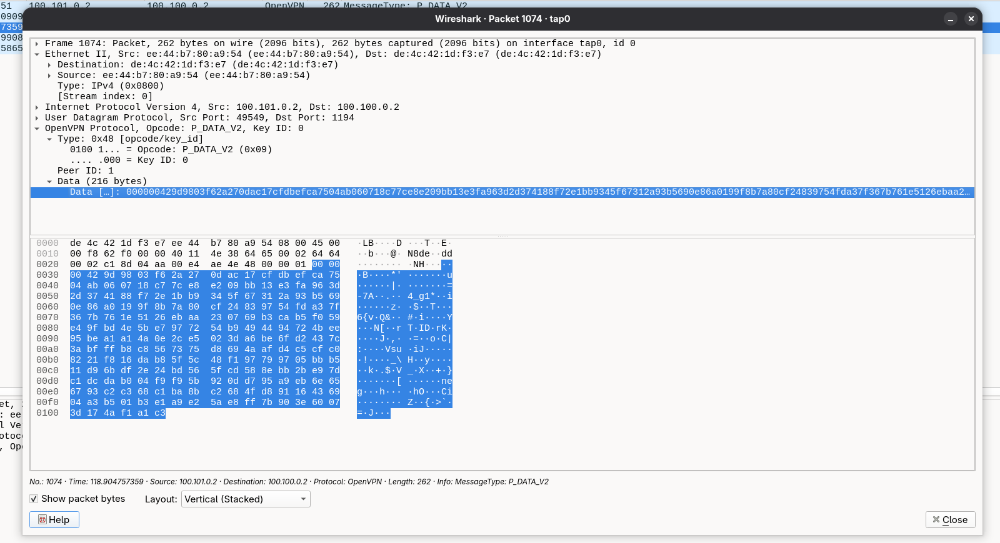


(Apparently random bytes)


### tun0 (tunnel uncrypted)


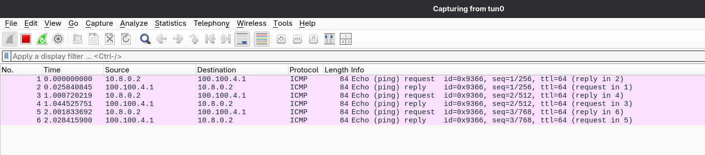

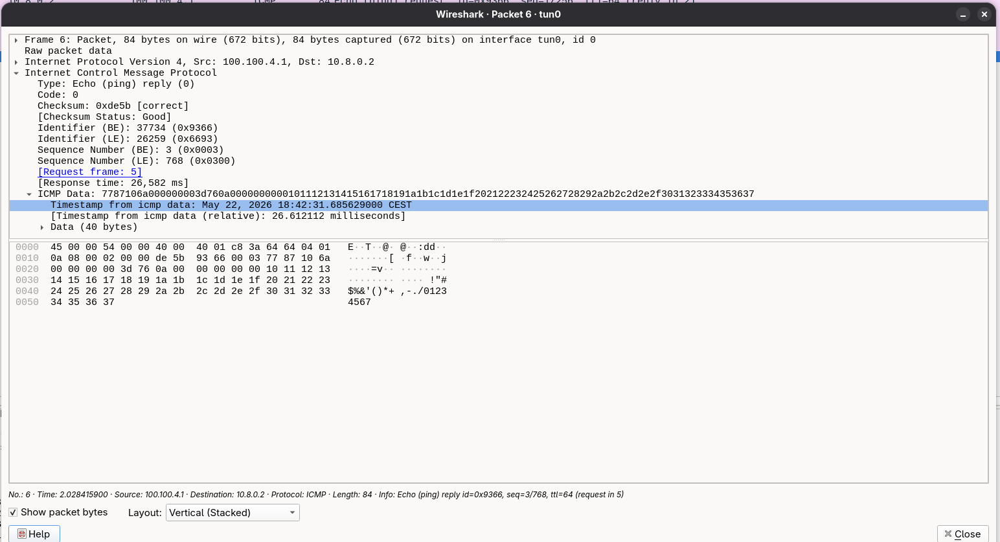


(Real ICMP data)


# Setup IPSec tunnel

Let's create the Certificates for the tunnel


1) We will reuse the CA created for Openvpn

- We create 2 new certificates (server certificate) inside the main firewall (internal-firewall,main-firewall)

(we set even the Alternatives names)


For main:
IP: 100.100.254.2

For internal
IP: 100.100.254.1 


(Ip are already assigned)


- We then export the key file for CA and we import it inside the internal firewall
-  We export the certificate for internal firewall and import it inside internal firewall (both Certificate detail and private key)


## IPSec conf on main

We create new VPN->IPSec->Connections (tunnel-to-internal)

local addr: 100.100.254.2
remote addr: 100.100.254.1

DPD delay 30
DPD timeout 120

(Dead peer detection)

then we add the local and remote auth


**ALWAYS USING PUBLIC KEYS:**

Local: (main firewall)

we select the certificate of the main firewall

Remote (internal firewall)

we selecte the certificate of the internal firewall 

### Adding children 


We add the children traffic

Local (what we offer from main)

- 10.8.2.0/24
- 10.8.3.0/24

Remote (what we want from internal)

- 100.100.1.0/24
- 100.100.2.0/24


Perché è meglio così
Tre motivi pratici:

Least privilege a livello protocollo: se per qualche bug nelle regole firewall Alice riuscisse a buttare un pacchetto verso 100.100.1.10, il tunnel IPSec stesso lo rifiuterebbe (la sua source 10.8.0.x non matcha nessun selector). È difesa in profondità.
Più facile da spiegare nel report: "il tunnel IPSec trasporta solo il traffico di power e admin verso le reti interne" è una frase molto più pulita di "il tunnel trasporta tutta la pool VPN".
Audit più chiaro: se domani guardi i counters dei Child SA su OPNsense, sai esattamente cosa ci sta passando — non c'è rumore da Alice/Bob anche se in teoria potrebbe entrare.


### Internal one

Same pattern but for internal firewall so

IPSec -> new connection -> same but mirrored params


## IPSec firewall rules

Inside main firewall ipsec firewall rules

vpn_power -> (internal_server_net)

internal_server_net is a new firewall alias that points to

100.100.1.0/24


vpn_admin -> any pass


Inside internal firewall ip sec firewall rules


- we firs create alias (vpn_power,vpn_admin)

Then

SERVER net -> vpn_power pass
any -> vpn_admin pass
vpn_power -> SERVER Net
vpn_admin -> any pass


## Check IPSec connnectivity


VPN->IPSec->Status overview (they must be connected)


# Check it works


First experiment is:

From physical interface (tap0) we capture UDP port on 1194 (OpenVPN)

Logged with Christina certificates (Power) we ping a internal server, so

```bash
➜  ~ ping -I tun0 100.100.1.2 
PING 100.100.1.2 (100.100.1.2) from 10.8.2.0 tun0: 56(84) bytes of data.
64 bytes from 100.100.1.2: icmp_seq=1 ttl=62 time=31.0 ms
64 bytes from 100.100.1.2: icmp_seq=2 ttl=62 time=30.0 ms
64 bytes from 100.100.1.2: icmp_seq=3 ttl=62 time=48.2 ms
^C
--- 100.100.1.2 ping statistics ---
3 packets transmitted, 3 received, 0% packet loss, time 2002ms
rtt min/avg/max/mdev = 30.002/36.416/48.235/8.367 ms
```

Recorded traffic:

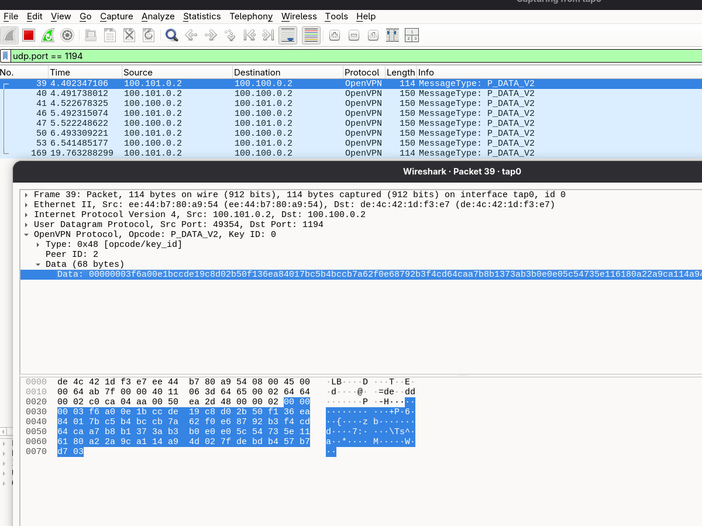


So it doesn't reveal anything about real ips, and it's encoded (OpenVPN)


then:

We check if (from firewall main to internal) ICMP traffic is passing via IPSec tunnel.


So we start packet capture from internal interface with protocol ESP (50) (Encapsulating Security Payload)


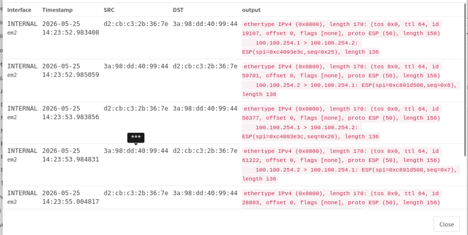


We check from interface tun0:


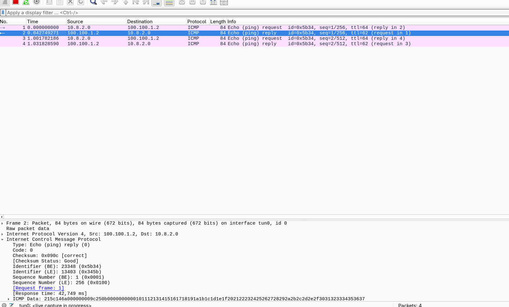


OpenVPN / IPSec connections


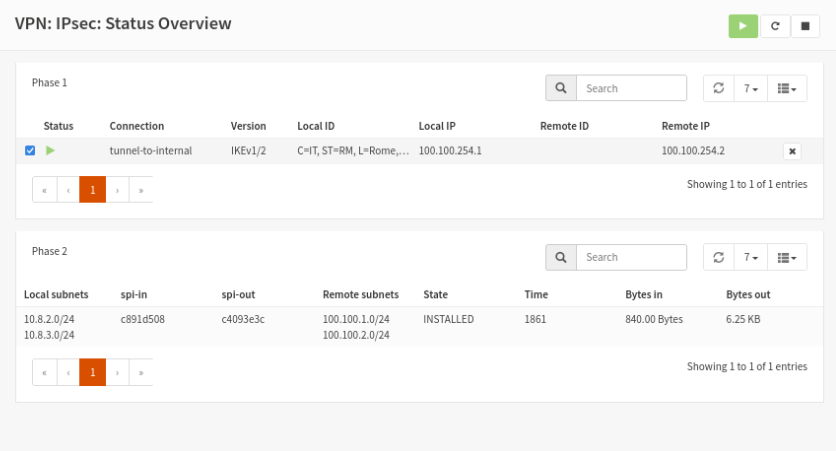
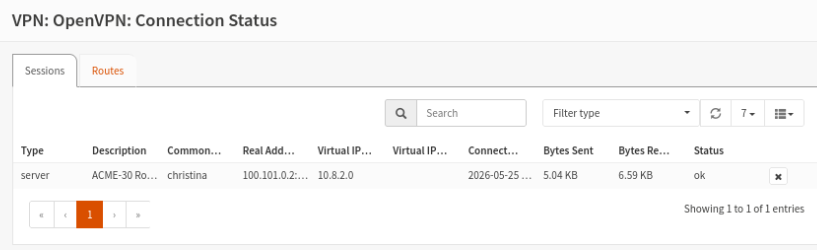


# Christina traceroute


```bash
➜  VPN traceroute 100.100.1.2
traceroute to 100.100.1.2 (100.100.1.2), 30 hops max, 60 byte packets
 1  10.8.0.1 (10.8.0.1)  32.431 ms  60.207 ms  60.181 ms
 2  * * *
 3  100.100.1.2 (100.100.1.2)  60.021 ms  59.967 ms  59.931 ms
➜  VPN 
```


1) Main OpenVPN
2) IPSec tunnel
3) Final destination


"Il traceroute da Christina verso il DNS server interno mostra l'attraversamento di due VPN concatenate: hop 1 è il gateway OpenVPN su Main (10.8.0.1), l'hop 2 è invisibile (* * *) perché il pacchetto attraversa il tunnel IPsec verso Internal in forma cifrata e i router intermedi non decrementano TTL sull'interfaccia tunneling, hop 3 è la destinazione finale. La trasparenza dell'hop intermedio è la firma comportamentale dei tunnel IPsec."


# Ipv6 OpenVPN


For correctness we choose to assign fd00:8:: pool for ips, which are ULA addressed (fc00::/7)


 so it would be


alice external fd00:8:0::/64
bob standard fd00:8:1::/64
christina standard fd00:8:2::/64
diana admin fd00:8:3::/64


## IPV6 Network for OpenVPN

VPN->OpenVPN->Add fd00:8::/64 as ipv6 network


## Client Specific Overrides

Alice: 

Tunnel: fd00:8::0:0/112
Local: 2001:470:b5b8:1e04::/64 (external)


Bob:

Tunnel: fd00:8::1:0/112
Local: 2001:470:b5b8:1e06::/64 (dmz)

Christina

Tunnel: fd00:8::2:0/112
Local: 2001:470:b5b8:1e06::/64 + 2001:470:b5b8:1e81::/64 (dmz+internal servers)


Diana

Tunnel: fd00:8::3:0/112
Local: all


## FIrewall aliases

vpn_external_v6 (content fd00:8::0:0/64)
vpn_standard_v6 (content fd00:8::1:0/64)
vpn_power_v6 (content fd00:8::2:0/64)
vpn_admin_v6 (content fd00:8::3:0/64)
internal_server_net_v6 (content 2001:470:b5b8:1e81::/64)

## Firewall rules

vpn_external_v6 -> external net pass
vpn_standard_v6 -> dmz net pass
vpn_power_v6 -> dmz+internal net server pass
vpn_admin_v6

# Connecting with alice certificates

```bash
10: tun0: <POINTOPOINT,NOARP,UP,LOWER_UP> mtu 1500 qdisc noqueue state UP group default qlen 1000
    link/none 
    inet 10.8.0.0 peer 255.255.255.252/32 scope global tun0
       valid_lft forever preferred_lft forever
    inet6 fd00:8::/112 scope global 
       valid_lft forever preferred_lft forever
    inet6 fe80::4ed1:1c8e:714e:ec39/64 scope link stable-privacy proto kernel_ll 
       valid_lft forever preferred_lft forever

```

we received both ipv4, ipv6 (fd00:8::)

Inside the ipv6 route for this interfasce we have

```bash
2001:470:b5b8:1e04::/64 dev tun0 metric 200 pref medium
fd00:8::/112 dev tun0 proto kernel metric 256 pref medium
```

which is correct 1e04::/64 is external services

Confirmed by ping on ext-1 (client in external)

```bash
➜  ~ ping -6 -I tun0 2001:470:b5b8:1e04:c757:cde4:3799:1c95
PING 2001:470:b5b8:1e04:c757:cde4:3799:1c95 (2001:470:b5b8:1e04:c757:cde4:3799:1c95) from fd00:8:: tun0: 56 data bytes
64 bytes from 2001:470:b5b8:1e04:c757:cde4:3799:1c95: icmp_seq=1 ttl=63 time=31.2 ms
64 bytes from 2001:470:b5b8:1e04:c757:cde4:3799:1c95: icmp_seq=2 ttl=63 time=85.2 ms
64 bytes from 2001:470:b5b8:1e04:c757:cde4:3799:1c95: icmp_seq=3 ttl=63 time=29.4 ms
^C
--- 2001:470:b5b8:1e04:c757:cde4:3799:1c95 ping statistics ---
3 packets transmitted, 3 received, 0% packet loss, time 2002ms
rtt min/avg/max/mdev = 29.447/48.611/85.230/25.902 ms
```

And not reaching dmz webserver (for example)

```bash
➜  ~ ping -6 -I tun0 2001:470:b5b8:1e06:40fa:57ff:fe4a:2073
ping: connect: Network is unreachable
➜  ~ 
```

Webserver in dmz is not reached since the route was not suggested, let's check if firewall rule is working by forcing the route...

```bash
sudo ip -6 route add 2001:470:b5b8:1e06::/64 dev tun0
```

```bash
➜  ~ ping -6 -I tun0 2001:470:b5b8:1e06:40fa:57ff:fe4a:2073
PING 2001:470:b5b8:1e06:40fa:57ff:fe4a:2073 (2001:470:b5b8:1e06:40fa:57ff:fe4a:2073) from fd00:8:: tun0: 56 data bytes
^C
--- 2001:470:b5b8:1e06:40fa:57ff:fe4a:2073 ping statistics ---
9 packets transmitted, 0 received, 100% packet loss, time 8170ms
```

Ok it's working !!


BY analyzing wireshark traffic I discovered ipv6 ICMP was encapsuleted inside Ipv4 packet, since the OpenVPN instance was using ONLY UDP portocol on port 1194

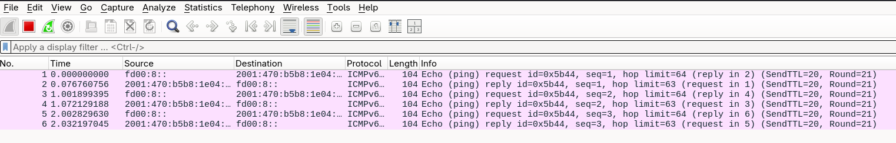
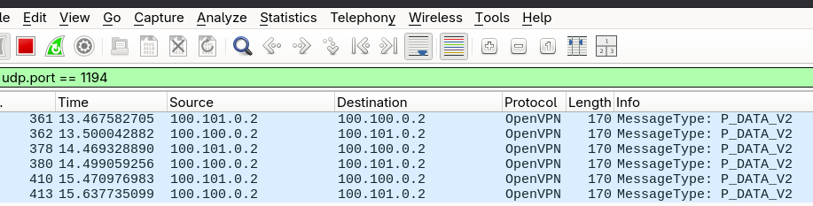


so it was ipv6 traffic inside ipv4 packet.

# Now IPV6 IPSec

Modify local/remote addresses in ipsec connection


Main firewall: 2001:470:b5b8:1e0f:d0cb:c3ff:fe2b:367e/64
Internal firewall (transit): 2001:470:b5b8:1e0f::2/128


So in the main firewall we add on local address the one of the main and in remote the internal


Add a children for already created connection

we add a main-to-internal-traffic-v6 with

- Local (power+admin)
    - fd00:8::2:0/112
    - fd00:8::3:0/112

- Remote
    2001:470:b5b8:1e81::/64 (internal servers v6)
2001:470:b5b8:1e82::/64 (clients network v6, verifica il prefisso reale)


Mirro this settings on the internal firewall and check status:

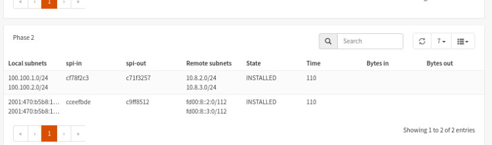


### Firewall rules

Add firewalls rules for ipsec


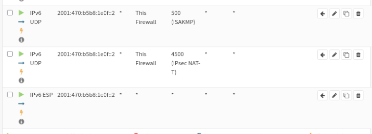


Firewalls rules for clients:


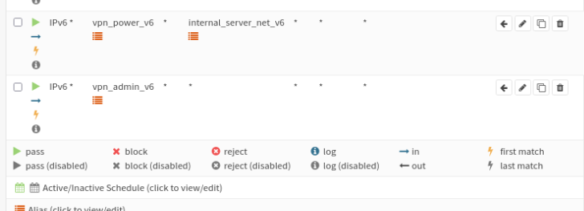


# Ping!!!!

using christina certificate:


```bash
16: tun0: <POINTOPOINT,NOARP,UP,LOWER_UP> mtu 1500 qdisc noqueue state UP group default qlen 1000
    link/none 
    inet 10.8.2.0 peer 255.255.255.252/32 scope global tun0
       valid_lft forever preferred_lft forever
    inet6 fd00:8::2:0/112 scope global 
       valid_lft forever preferred_lft forever
    inet6 fe80::14dc:9a4a:639:709f/64 scope link stable-privacy proto kernel_ll 
       valid_lft forever preferred_lft forever
➜  VPN 
```


Ping on dns server inside internal servers

```bash
➜  VPN ping -6 -I tun0 2001:470:b5b8:1e81:4730:4341:85e8:4a85
PING 2001:470:b5b8:1e81:4730:4341:85e8:4a85 (2001:470:b5b8:1e81:4730:4341:85e8:4a85) from fd00:8::2:0 tun0: 56 data bytes
64 bytes from 2001:470:b5b8:1e81:4730:4341:85e8:4a85: icmp_seq=1 ttl=62 time=123 ms
64 bytes from 2001:470:b5b8:1e81:4730:4341:85e8:4a85: icmp_seq=2 ttl=62 time=100 ms
64 bytes from 2001:470:b5b8:1e81:4730:4341:85e8:4a85: icmp_seq=3 ttl=62 time=108 ms
^C
--- 2001:470:b5b8:1e81:4730:4341:85e8:4a85 ping statistics ---
3 packets transmitted, 3 received, 0% packet loss, time 1999ms
rtt min/avg/max/mdev = 100.423/110.306/122.957/9.405 ms
```


# Check IPV6 OpenVPN + IPSec tunnel 

Using diana certificates,

Ping to 2001:470:b5b8:1e81:4730:4341:85e8:4a85 (dns server) inside internal server firewall


From diana client (physical interface) (tap0)

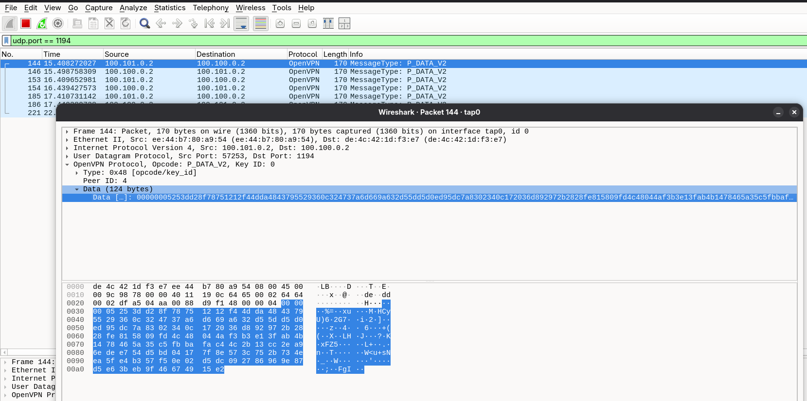

(Encrypted OpenVPN traffic)

From tun0 the traffic is clear (ICMPv6 traffic)

```bash
Frame 1: Packet, 104 bytes on wire (832 bits), 104 bytes captured (832 bits) on interface tun0, id 0
    Section number: 1
    Interface id: 0 (tun0)
        Interface name: tun0
    Encapsulation type: Raw IP (7)
    Arrival Time: May 25, 2026 22:07:07.140905352 CEST
    UTC Arrival Time: May 25, 2026 20:07:07.140905352 UTC
    Epoch Arrival Time: 1779739627.140905352
    [Time shift for this packet: 0.000000000 seconds]
    [Time since reference or first frame: 0.000000000 seconds]
    Frame Number: 1
    Frame Length: 104 bytes (832 bits)
    Capture Length: 104 bytes (832 bits)
    [Frame is marked: False]
    [Frame is ignored: False]
    [Protocols in frame: raw:ipv6:icmpv6:hipercontracer]
    Character encoding: ASCII (0)
    [Coloring Rule Name: ICMP]
    [Coloring Rule String: icmp || icmpv6]
Raw packet data
Internet Protocol Version 6, Src: fd00:8::3:0, Dst: 2001:470:b5b8:1e81:4730:4341:85e8:4a85
Internet Control Message Protocol v6
HiPerConTracer Trace Service
```

Packet capture from Main firwall on interface INTERNAL looking


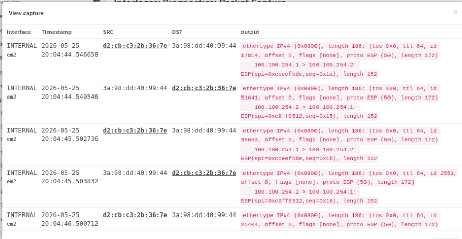

(ESP Packet)


Traceroute

```bash
➜  ~ traceroute -6 2001:470:b5b8:1e81:4730:4341:85e8:4a85 
traceroute to 2001:470:b5b8:1e81:4730:4341:85e8:4a85 (2001:470:b5b8:1e81:4730:4341:85e8:4a85), 30 hops max, 80 byte packets
 1  fd00:8::1 (fd00:8::1)  43.554 ms  43.539 ms  43.525 ms
 2  * * *
 3  2001:470:b5b8:1e81:4730:4341:85e8:4a85 (2001:470:b5b8:1e81:4730:4341:85e8:4a85)  43.404 ms  43.390 ms  43.369 ms
➜  ~ 
```

1) hop1 OpenVPN
2) IPSEC
3) response


