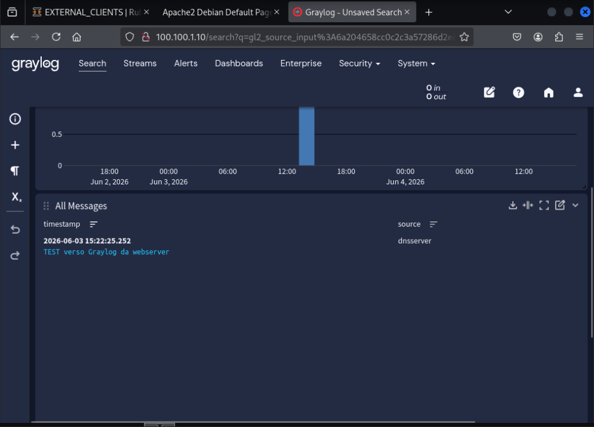
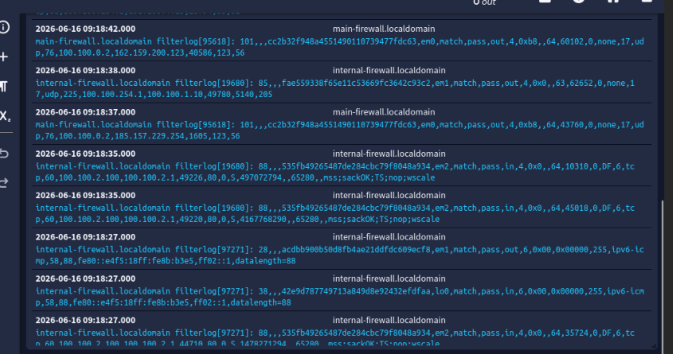
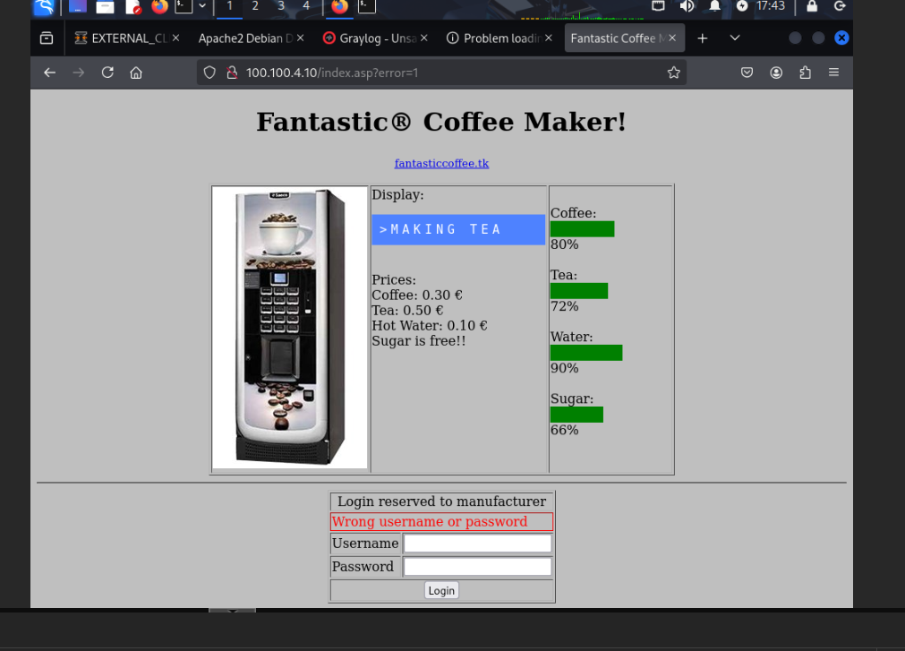
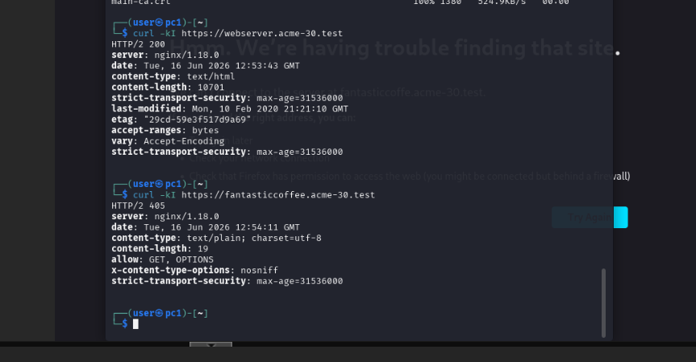
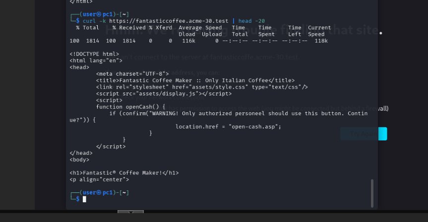
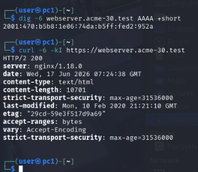
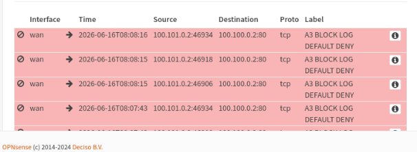

# ACME 30 — Services configuration & IPv6 policy extension

This document complements `ACME_30_main_firewall_final_explanation_EN.md` and
`ACME_30_internal_firewall_final_explanation_EN.md`. It records:

1. the configuration of the ACME services (assignment requirement no. 4);
2. the extension of the security policy to **IPv6**, which was missing from the
   first firewall configuration (the network is dual-stack since Assignment 1).

---

# 1. Services of the ACME co.

All seven required services were configured with a minimal but realistic setup.

| # | Service | Host | State |
|---|---|---|---|
| 1 | Web service | `webserver` `100.100.6.2` | Apache2, HTTPS + 80→443 redirect, cert from internal CA |
| 2 | DNS | `dnsserver` `100.100.1.2` | dnsmasq, domain `acme-30.test`, A + AAAA records |
| 3 | Syslog | `logserver` `100.100.1.3` | rsyslog, UDP/514, per-host log files |
| 4 | Proxy | `proxyserver` `100.100.6.3` | Squid forward (3128) + nginx reverse (443, SNI) |
| 5 | Log collector | `graylog` `100.100.1.10` | Syslog UDP/5140 + GELF UDP/12201 inputs, UI on :80 |
| 6 | Vulnerability scanner | `greenbone` `100.100.1.4` | GVM/GSA, UI on HTTPS :9392 |
| 7 | Vending machine | `fantasticcoffee` `100.100.4.10` | HTTP site, published over HTTPS via reverse proxy |

## 1.1 Web server (HTTPS + redirect)

The web service runs on Apache2. A **server certificate** for
`webserver.acme-30.test` was issued from the internal CA (the same CA used in
Assignment 2), with SANs covering the DNS name, the IPv4 and the IPv6 address.
Apache terminates TLS on 443 and a dedicated vhost on port 80 issues a
permanent redirect to HTTPS:

```text
http://localhost/   -> 301 Moved Permanently -> https://webserver.acme-30.test/
https://localhost/  -> 200 OK (HSTS enabled)
```

The certificate chain validated from another host shows the correct issuer:

```text
subject = CN = webserver.acme-30.test
issuer  = CN = internal-ca
X509v3 Subject Alternative Name:
    DNS:webserver.acme-30.test, IP:100.100.6.2,
    IP:2001:470:B5B8:1E06:40FA:57FF:FE4A:2073, DNS:webserver
```

## 1.2 Proxy server (forward + reverse)

The proxy host plays two distinct roles on different ports:

- **Squid forward proxy** on `3128`: the only authorized path for internal
  hosts to browse HTTP/HTTPS towards the Internet. Source ACLs restrict its use
  to the ACME subnets and the VPN pools.
- **nginx reverse proxy** on `80/443`: TLS termination point that publishes the
  internal web services. It uses **SNI multi-certificate** to serve two
  different sites with two separate certificates:
  - `webserver.acme-30.test`   → backend `https://100.100.6.2`
  - `fantasticcoffee.acme-30.test` → backend `http://100.100.4.10`

This is the key design choice: the external world only ever talks to the
reverse proxy; the real backends are never exposed directly, and HTTP is
upgraded to HTTPS at the perimeter (the vending machine, which only speaks
HTTP, is therefore reachable over HTTPS). SNI was verified by requesting each
name and observing that nginx presents the matching certificate.

## 1.3 Centralized logging

`logserver` receives syslog on UDP/514 and stores one file per source host
(`/var/log/remote/<host>/<program>.log`). `graylog` exposes a **Syslog UDP**
input on 5140 and a **GELF UDP** input on 12201; its web UI listens on port 80
(not 9000, as discovered during testing). A test message sent from a host is
correctly received and indexed:



> Note on time synchronization: all ACME hosts are LXC containers sharing the
> Proxmox host kernel clock, so log timestamps are already coherent and no NTP
> client is required inside the containers.

### Firewalls forwarding their own logs

Both firewalls were configured (System → Settings → Logging targets) to forward
their **packet-filter** logs to Graylog via Syslog UDP/5140, so that pass/block
events of the policy are centralized and not kept only locally. The Main FW
crosses the Internal FW to reach Graylog, so an explicit pass rule was added on
the Internal FW EXTERNAL tab: `100.100.254.1 → graylog:5140`. Graylog receives
the `filterlog` events from both `internal-firewall` and `main-firewall`:



### Syslog over TLS (RFC 5425) — hardening

In addition to the mandatory UDP/514 channel, an encrypted syslog channel was
added as hardening. The log server runs an rsyslog TLS listener on **TCP/6514**
(`rsyslog-gnutls`, `gtls` driver) using a server certificate issued by the
internal CA (`logserver.acme-30.test`). A client (the web server) forwards its
logs over TLS with `omfwd`, verifying the server identity against the CA
(`StreamDriverAuthMode=x509/name`, permitted peer `logserver.acme-30.test`).
The firewall was opened for `net_dmz → host_logserver:6514 (TCP)` on both the
Main (DMZ tab) and Internal (EXTERNAL tab) firewalls. The plaintext UDP/514
channel is kept as the required baseline; mutual TLS (client certificates) is
noted as a further hardening step.

> Note: internal hosts have no direct Internet access, so packages such as
> `rsyslog-gnutls` were installed through the forward proxy by pointing
> `apt` at `http://100.100.6.3:3128` — a practical confirmation that the
> proxy-only egress policy is enforced.

A message logged on the web server is delivered to the log server under
`/var/log/remote/webserver/`, and a `tcpdump` on TCP/6514 shows only encrypted
TLS application data (no readable payload), unlike the plaintext UDP/514
channel:

```text
$ tcpdump -ni any -A tcp port 6514
12:45:18 IP 100.100.6.2.38596 > 100.100.1.3.6514: Flags [P.], length 110
E...
.@.>.a.dd..dd.....r....)..w....l......
N_5"........i........jw... (... encrypted, unreadable ...)
12:45:18 IP 100.100.1.3.6514 > 100.100.6.2.38596: Flags [.], ack 110
```

## 1.4 Greenbone & fantasticcoffee

Greenbone (GVM) services (`postgresql`, `redis`, `ospd-openvas`, `gvmd`,
`gsad`) were enabled and the UI is reachable over HTTPS on 9392, restricted by
firewall to the admin host only. The vending machine `fantasticcoffee` serves
its HTTP page and is published externally only through the reverse proxy:



---

# 2. IPv6 policy extension

## 2.1 Problem found in the first configuration

The first firewall configuration implemented the whole A3 policy with
**IPv4-only** pass rules (`ipprotocol = inet`), while the per-interface
default-deny rule was `inet46`. Because the network is dual-stack since
Assignment 1 (every host has a global IPv6 address, DNS returns AAAA records,
the reverse proxy listens on `[::]:443`), the effect was that **all legitimate
IPv6 service traffic was silently dropped** by the default-deny. The Squid
`dns_v4_first on` workaround was only masking this missing-policy symptom.

We therefore extended the policy to IPv6 instead of disabling it, to stay
consistent with the dual-stack design of A1/A2.

## 2.2 Dual-stack aliases

The existing host and network aliases were extended with the corresponding
IPv6 addresses/prefixes, so that a single `inet46` rule covers both families:

| Alias | IPv6 added |
|---|---|
| `host_webserver` | `2001:470:b5b8:1e06:40fa:57ff:fe4a:2073` |
| `host_proxyserver` | `2001:470:b5b8:1e06:74da:b5ff:fed2:952a` |
| `host_dnsserver` | `2001:470:b5b8:1e81:4730:4341:85e8:4a85` |
| `host_logserver` | `2001:470:b5b8:1e81:14cd:d6ff:fe00:4e4c` |
| `host_greenbone` | `2001:470:b5b8:1e81:e03b:f1ff:fef8:8a8c` |
| `host_graylog` | `2001:470:b5b8:1e81:8c:10ff:fe8c:c954` |
| `host_admin` | `2001:470:b5b8:1e82:7ab2:ec67:312:97d9` |
| `net_dmz` | `2001:470:b5b8:1e06::/64` |
| `net_srv` | `2001:470:b5b8:1e81::/64` |
| `net_clients` | `2001:470:b5b8:1e82::/64` |
| `net_ext` | `2001:470:b5b8:1e04::/64` |

`host_fantasticcoffee` was left IPv4-only (the container has no reachable IPv6,
and the reverse proxy reaches it over IPv4 anyway).

## 2.3 Rules converted to `inet46`

Only the flows whose backend service actually listens on IPv6 were converted;
IPv4-only services were left as `inet` to avoid useless rules:

| Rule | Family | Reason |
|---|---|---|
| WAN → reverse proxy | inet46 | nginx listens on `[::]:443` |
| proxy → Internet | inet46 | enables IPv6 egress (removes `dns_v4_first` need) |
| DMZ → DNS | inet46 | dnsmasq answers over IPv6 |
| DMZ → syslog | inet46 | rsyslog listens on `[::]:514` |
| external clients → reverse proxy | inet46 | nginx v6 |
| clients → reverse proxy | inet46 | nginx v6 |
| greenbone scan → DMZ / ext / clients | inet46 | hosts have v6 addresses to scan |
| reverse → fantasticcoffee | inet | nginx `proxy_pass` uses IPv4 literal |
| clients/servers → forward proxy (3128) | inet | Squid forward listens on IPv4 only |
| → graylog 5140/12201 | inet | Graylog inputs bound to `0.0.0.0` only |
| dnsserver → external DNS | inet | upstream resolvers are IPv4 |

## 2.4 ICMPv6

An explicit **ICMPv6** pass rule was added on each internal interface allowing
the essential types (echo request/reply, NS/NA, RS/RA, packet-too-big,
time-exceeded, parameter-problem). This is required by RFC 4890: in particular
*packet-too-big* must traverse the firewall for IPv6 PMTUD to work, otherwise
large IPv6 connections stall.

## 2.5 DNS aligned to the reverse proxy

To keep DNS and firewall policy consistent, the internal DNS names of the
published web services were pointed to the **reverse proxy** instead of the
real backends, so that name resolution matches the rule that only allows
clients to reach the proxy:

```text
webserver.acme-30.test       -> 100.100.6.3 (proxy)
fantasticcoffee.acme-30.test -> 100.100.6.3 (proxy)
```

The backends (`100.100.6.2`, `100.100.4.10`) are reached by the proxy via IPv4
literals in the nginx config and are not published under a DNS name. With this
alignment, internal clients reach both services **by name without any manual
`--resolve`**, transparently through the reverse proxy (the `server: nginx`
header confirms the path):



A `GET` on the vending machine returns its real HTML page, served end-to-end
through the reverse proxy over HTTPS:



## 2.6 Cleanup

The temporary rule `A3 TEMP ALLOW ANY TO MAIN FW GUI`, used during the initial
setup, was **removed**: it allowed `any → firewall GUI` and contradicted the
"management only from the admin host" policy.

---

# 3. IPv6 enforcement tests

## 3.1 Allowed flows (from Kali, clients network)

DNS resolution over IPv6 and access to the published web service through the
reverse proxy over IPv6 both succeed:

```text
$ dig -6 @2001:470:b5b8:1e81:4730:4341:85e8:4a85 webserver.acme-30.test AAAA +short
2001:470:b5b8:1e06:40fa:57ff:fe4a:2073

$ curl -6 -kI --resolve webserver.acme-30.test:443:2001:470:b5b8:1e06:74da:b5ff:fed2:952a \
       https://webserver.acme-30.test/
HTTP/2 200
server: nginx/1.18.0
strict-transport-security: max-age=31536000
```



## 3.2 Denied flows (default-deny + logging)

Traffic that is not explicitly permitted is blocked and logged by the final
`A3 BLOCK LOG DEFAULT DENY` rule, as shown in the firewall Live View:



---

# 4. Remaining items (before submission)

| Item | State |
|---|---|
| Remove `A3 TEMP ALLOW ANY TO MAIN FW GUI` | done |
| Firewall GUI over HTTPS | done |
| Firewalls forward their own logs to Graylog | done |
| Syslog over TLS (RFC 5425) on TCP/6514 | done (webserver → logserver) |
| Anti-spoofing on WAN (block bogon/private) | skipped (lab uses public-range WAN) |
| Revert temporary root/password SSH on hosts | skipped (not in firewall scope) |
| Align internal DNS names to the reverse proxy | done |
| Export `ACME_30_main.xml` / `ACME_30_internal.xml` | to do |
| Report (8 sections) | to do |
